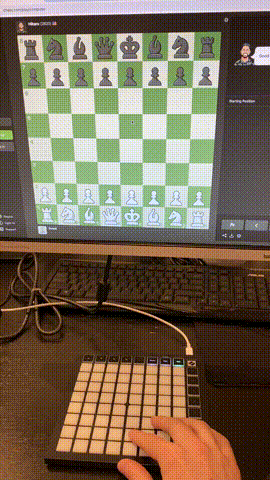

# What's this?

BulletBox is a Chrome extension that turns the Novation Launchpad Mini MIDI controller into a controller for Chess.com. Each white button on the Launchpad corresponds to a square on the chessboard, giving you an intuitive way to make moves.

Designed with bullet chess in mind, BulletBox lets you use both hands to make moves faster than with a mouse. In time scrambles, fractions of a second matter - save time on your inputs and put pressure on your opponent's clock!

# Setup

1. Install the BulletBox chrome extension [here](https://chromewebstore.google.com/detail/bulletbox/hikbolfgjcmonllkdgeaclojdjajgjeo).
2. Connect your Novation Launchpad Mini controller to your computer via USB.
3. On the Launchpad Mini, press the User button. Make sure that the controller stays in this mode when playing. If you have custom user programs installed on the Launchpad, use a blank program or perform a factory reset to avoid conflicts.
4. Open chess.com in Chrome. Chrome will ask for permission to allow chess.com to control and reprogram your MIDI devices. Click Allow.
5. BulletBox should now be able to control the chessboard on chess.com!

Note: BulletBox has only been tested in the Online Play, Puzzle, and Analysis modes. It may not work as expected on other pages.

# Controls

Make sure the controller is set to User mode at all times.

## Making Moves
To make a move:
1. Press the button that corresponds to the square of the piece you want to move.
2. Then press the button for the destination square.

Example:
- To open with e4 as white, press the e2 button, then the e4 button.

## Pawn Promotion
1. Move your pawn to the final rank like normal (e.g., e7 → e8).
2. When the promotion menu appears, use the **black arrow buttons** above the white pads to select the promotion piece:
    - ↑ Up: Queen
    - ↓ Down: Knight
    - ← Left: Rook
    - → Right: Bishop
 